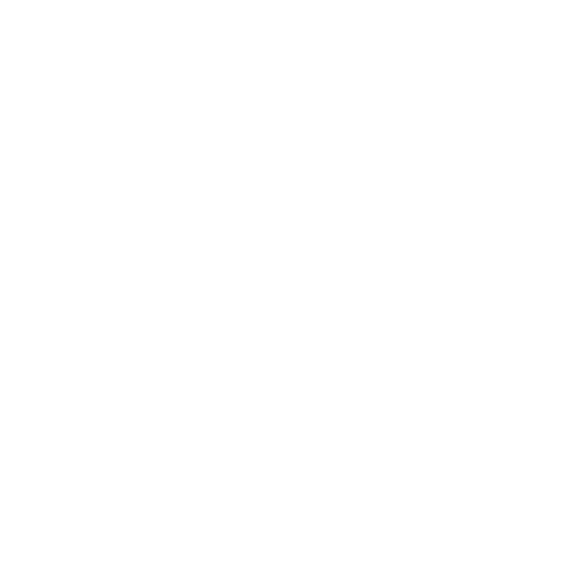

<div align="center">

<br />


<p align="center">
  <a href="https://linkedin.com/in/yashwanth1617"></a>
  <a href="mailto:yashwanthbalamurugan97@gmail.com"></a>
  <a href="https://github.com/Yashwanth1617"></a>
</p>

<br />

<div align="left">

### ✦ 𝐀 𝐁 𝐎 𝐔 𝐓  𝐌 𝐄


```json
{
  "name": "Yashwanth B.",
  "degree": "B.Tech in AIE (Batch: 2024 - 2028)",
  "languages": ["Python", "C++", "C", "JavaScript", "TypeScript", "Dart", "HTML", "CSS"],
  "paper": {
    "count": 1,
    "journal": "Results in Engineering, Elsevier"
  },
  "interests": ["Agentic AI", "LLMs", "RAG"]
}
```

</div>
<br clear="all" />

<br />


### ✦ 𝐄 𝐗 𝐏 𝐄 𝐑 𝐓 𝐈 𝐒 𝐄

<br />


<br />
<br />
<div align="center">
  
  
  
  
  
</div>

<br />
<br />


### ✦ 𝐒 𝐄 𝐋 𝐄 𝐂 𝐓 𝐄 𝐃  𝐖 𝐎 𝐑 𝐊 𝐒

<br />

<table align="center" width="100%">
  <tr>
    <td width="50%" valign="top">
      <h4>🤝 DealFlow AI</h4>
      <p><i>Intelligent Matcher for Investors & Founders</i></p>
      <p>Engineered a full-stack RAG pipeline using <b>Weaviate</b> and <b>Google Gemini</b> to provide context-aware insights on startup documentation.</p>
      <p>Built with <b>Next.js 14</b>, <b>FastAPI</b>, and <b>Supabase</b>.</p>
    </td>
    <td width="50%" valign="top">
      <h4>📱 Campus Lost & Found</h4>
      <p><i>Cross-Platform Mobile Application</i></p>
      <p>Designed and developed a real-time, cross-platform synchronization system using <b>Flutter</b> and <b>Supabase Realtime</b>.</p>
      <p>Secured with advanced RBAC and Row Level Security.</p>
    </td>
  </tr>
</table>

<br />


### ✦ 𝐑 𝐄 𝐒 𝐄 𝐀 𝐑 𝐂 𝐇  &  𝐏 𝐔 𝐁 𝐋 𝐈 𝐂 𝐀 𝐓 𝐈 𝐎 𝐍 𝐒

<br />

**HydroSentinel: An IoT-enabled ASV for dual-scale riverine plastic detection and remediation**  
*Published in Results in Engineering, Elsevier, Vol. 30, 2026, 111129.*  
> A research initiative addressing environmental challenges through AI and robotics.  
> 🔗 [Read the Paper](https://doi.org/10.1016/j.rineng.2026.111129)

<br />


### ✦ 𝐀 𝐂 𝐓 𝐈 𝐕 𝐈 𝐓 𝐘  &  𝐌 𝐄 𝐓 𝐑 𝐈 𝐂 𝐒

<br />


<br />

<div align="center">
  
</div>

<br />
<br />

</div>
